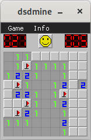

# dsdmine
This is an cross platform implementation of Minesweeper-like game written from scratch in C++ with SDL2, Dear ImGui and mINI. 

<span style="display:block;text-align:center">

## Build guide

### 1. Clone repository

### 2. Install SDL2 and cmake 

#### Linux:
Install SDL2 development library and cmake. For information about installing packages check manual of distribution you are using.

#### Windows:
Download and install [CMake](https://cmake.org) and [SDL2](https://www.libsdl.org). Make sure to download development libraries for Visual C++. SDL2 is expected to be present in sdl2 directory in source root. Create sdl2 directory in source root and extract downloaded archive there. Change extracted directory name to SDL2 (this directory should contain lib and include directories). If you wish to use different directory for SDL2 modify CMakeLists.txt file to point SDL2_PATH variable to selected directory. Build was tested with Visual Studio 2022 Community Edition but probably older versions (not older than Visual Studio 2017 as support for C++17 is required) should be able to build it as well (not tested).

#### macOS:
Build was tested with framework installation. Download and install [CMake](https://cmake.org). Also download [SDL2](https://www.libsdl.org). Install SDL2 framework in /Library/Frameworks directory. Command line developers tools are also needed.

### 3. Build
#### Linux and macOS:
Use terminal to go to the source root directory and run following commands:
```console
mkdir build
cd build
cmake .. -DCMAKE_BUILD_TYPE=Release
make
```

#### Windows:
Use CMake to generate Visual Studio solution. Open and build generated solution in Visual Studio.

### 4. Running

On Windows and Linux dsdmine expects assets directory to be present in the same directory as main binary. On Windows also SDL2 DLL is needed. It is distributed with development archive downloaded in step 2. On macOS build generates App Bundle (dsdmine.app) and assets directory is automatically copied into generated bundle.

## Manual
### Command line arguments

**-portable** - Run without creating and reading ini configuration file. Best times won't be saved.

**-scale=value** - Scale game window and content by times specified in value that needs to be between 1 and 10. Useful for screens with big resolution.

### Configuration
Configuration file is located in these directories:

#### Linux
~/.local/share/DragonSWDev/dsdmine/

#### Windows
%appdata%\DragonSWDev\dsdmine\

#### macOS
~/Library/Application Support/DragonSWDev/dsdmine/

## License
dsdmine is distributed under the terms of MIT License. Project depends on [SDL2](https://www.libsdl.org), [stb_image](https://github.com/nothings/stb/), [Dear ImGui](https://github.com/ocornut/imgui) and [mINI](https://github.com/pulzed/mINI). For information about these dependencies licensing check their respective websites.
